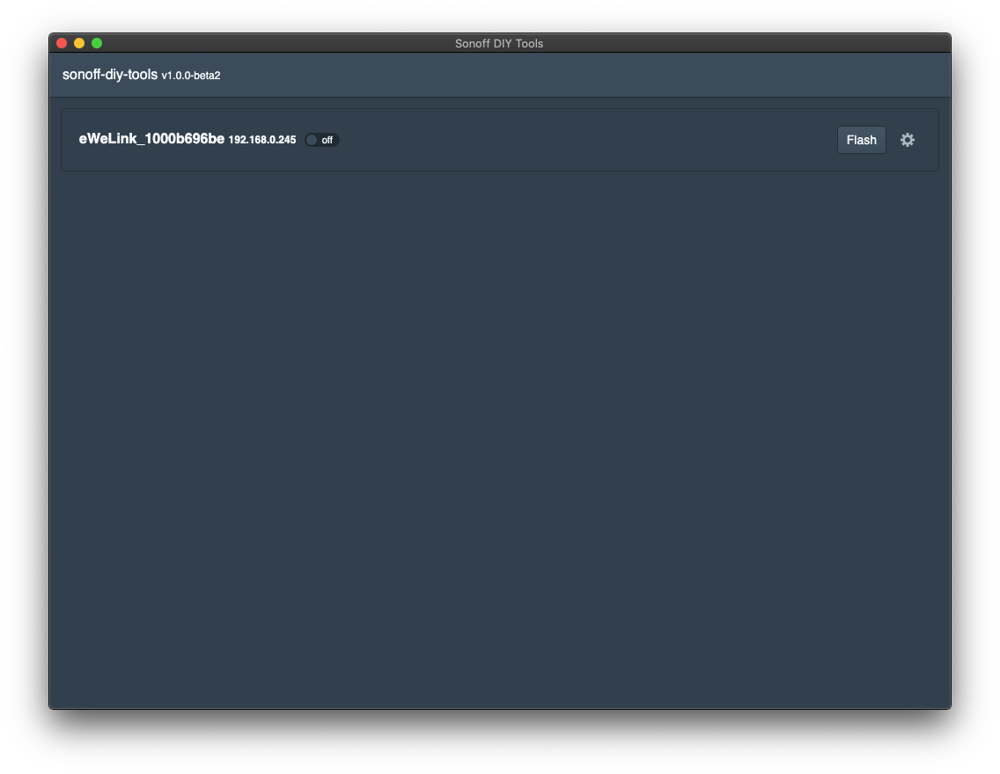

# sonoff-diy-tools   
Tools to configure with sonoff devices in DIY mode

## Running a release

Download a release for your operating system from the [releases](https://github.com/mashupmill/sonoff-diy-tools/releases) page and then open it.

## Running from source

* Clone the repository
* Install dependencies (`npm install`)
* Start up the app (`npm start`)

## Screenshots

